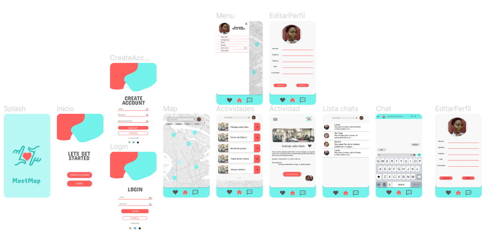
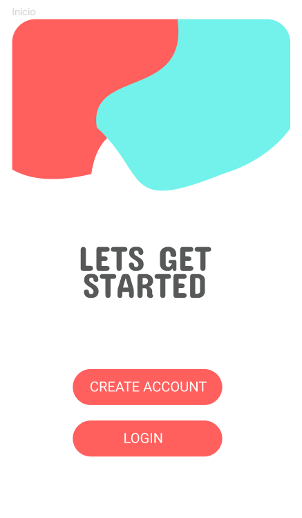
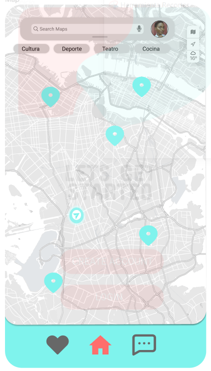
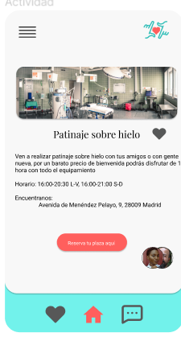
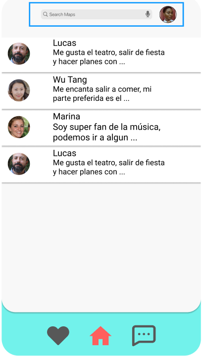
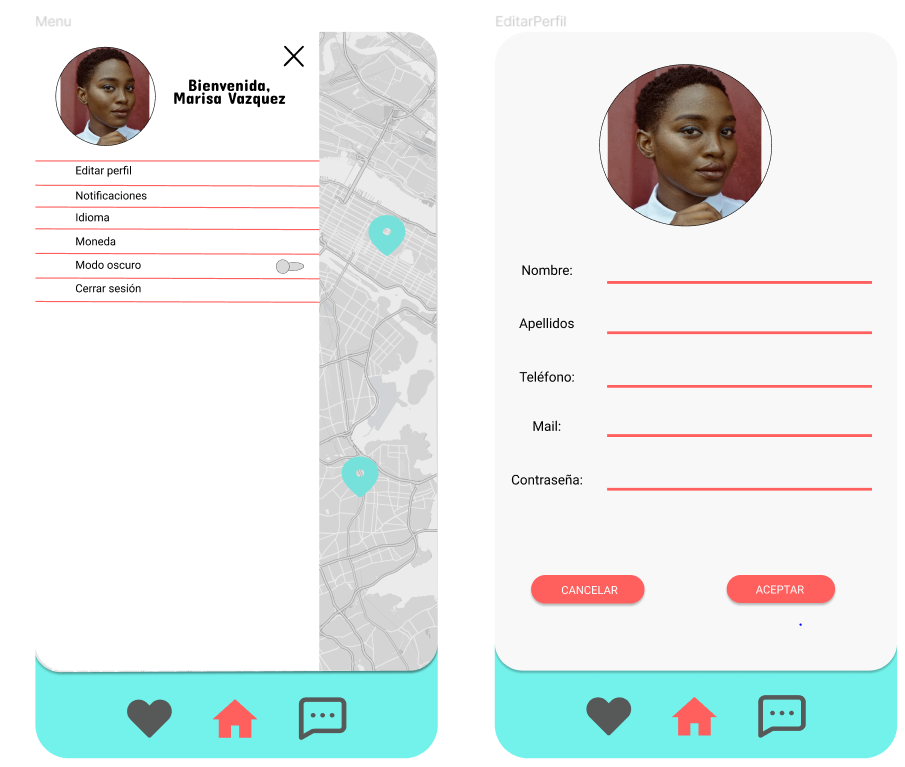

# MeetMap
Application that allows you to see the next activities in your city and meet people on them. This project will be made by Almudena Fernandez, Iker Iturralde and Nerea Ramos for the modules: "Desarrollo de Interfaces" and "Programación Multimedia y dispositivos Móviles"

## [Figma prototype](https://www.figma.com/file/BnFUxtnABdXq7QyjVwtNXr/MeetMap?node-id=58%3A35&t=M3GuCny9oMMSULwz-1)

## User manual

#### Welcome to MeetMap, an application that will allow you to meet a lot of people doing really interesting plans in Madrid.

##### The app is simple, the first time that you open it, u will have to choose between login or sing up, since the app has a carousel with the posibilities of the same

##### The following times that you start the app, you will be automaticaly directed to the map, the principal function of MeetMap

In this map, u will see the nearest activities in the zone (actually just in Madrid). You can select any and sing up to do them.
Additionaly, the user will be able to search something in a bar, or filter the activities.
Once the user select one of the activities, he will see something like that:

As you can see, the activity will show some info, a button for save it and another button which show the people who is already sing up. If you click that button, you will see a list with that people, something like that:

The user can click in any of this people to chat with them, of course, any user can block his appearence in this list.

Finally, back in the map, we can see:
##### The like button, where you can see the plans that you has selected
##### The chat button, where you can see the chats with other people
##### A slide menu, where the user has a lot of posibilities, like that:

Also, you can see an example of edit your profile.
